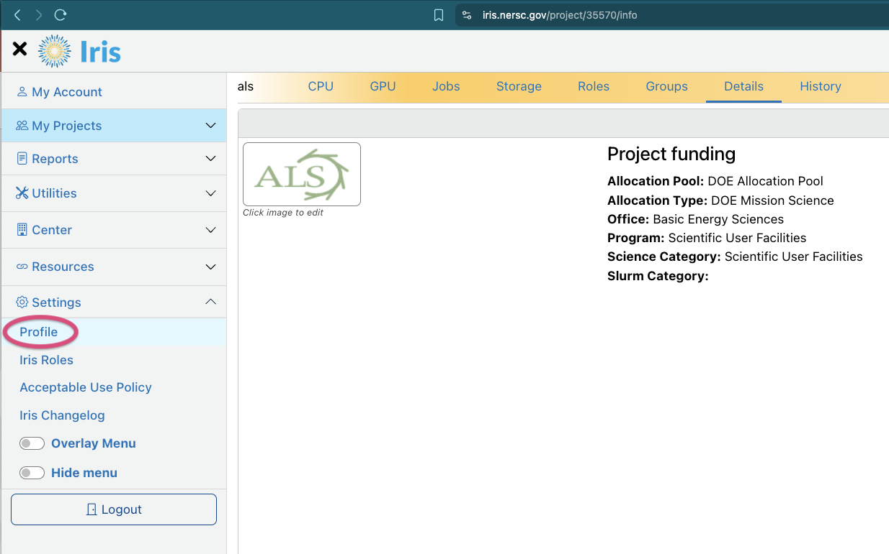
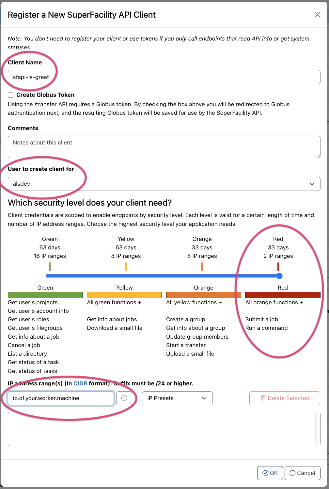

# Run Tomography Reconstruction Remotely at NERSC

## Request an account

Refer to the [NERSC Documentation on how to obtain a user account](https://docs.nersc.gov/accounts/).

## Login to Iris

NERSC user accounts are managed in the [Iris](https://iris.nersc.gov/login) system, which you can access once you have an account. For more information on how to use Iris, please see the [Iris documentation](https://docs.nersc.gov/iris/iris-for-users/).

## SFAPI

Superfacility API Clients (SFAPI) is the gateway to running remote tasks on NERSC, and the method we support for scheduling jobs via SLURM. To create a new SFAPI client:

1. Login to [Iris](https://iris.nersc.gov/login) and navigate to the Profile section, found either on the menu bar at the top or under Settings on the left panel.

2. Scroll all the way to the bottom to the **Superfacility API Clients** section and press the '+ New Client' button

3. Fill out the form

    a. Client Name (ex: 'tomo-sfapi')
    
    b. Comments (blank)
    
    c. User to create client for ('alsdev')
    
    d. Which security level does your client need ('Red')

    e. IP address ranges (Your IP, perlmutter nodes)

4. Save the SFAPI keys in a safe place. You will need these to launch jobs on NERSC.

## NERSC System Status

Sometimes the system is down. [Check the status](https://www.nersc.gov/live-status/motd/) for unexpected and routine maintainence.

## Slurm

NERSC uses the [Slurm workload manager](https://slurm.schedmd.com/documentation.html) to schedule jobs. Here is an example of Slurm job script we use to run reconstruction:

    #!/bin/bash
    #SBATCH -q realtime
    #SBATCH -A als
    #SBATCH -C cpu
    #SBATCH --job-name=tomo_multires_{folder_name}_{file_name}
    #SBATCH --output={pscratch_path}/tomo_recon_logs/%x_%j.out
    #SBATCH --error={pscratch_path}/tomo_recon_logs/%x_%j.err
    #SBATCH -N 1
    #SBATCH --ntasks-per-node 1
    #SBATCH --cpus-per-task 64
    #SBATCH --time=0:15:00
    #SBATCH --exclusive

    date

    echo "Running multires container..."
    srun podman-hpc run \
    --volume {recon_scripts_dir}/tiff_to_zarr.py:/alsuser/tiff_to_zarr.py \
    --volume {pscratch_path}/8.3.2:/alsdata \
    --volume {pscratch_path}/8.3.2:/alsuser/ \
    {multires_image} \
    bash -c "python tiff_to_zarr.py {recon_path} --raw_file {raw_path}"

    date

Definitions:

- **--q**: the selected queue or QOS
    - NERSC provides a [few different queue options.](https://docs.nersc.gov/jobs/policy/#perlmutter-cpu) The `debug` queue is usually quick to pick up jobs for testing purposes.
    - The `alsdev` account on NERSC has access to the `realtime` queue. [You must request access to use this queue.](https://docs.nersc.gov/policies/resource-usage/#p-realtime)
- **--A**: the project on NERSC to charge the job

- **--job-name**: Sets a descriptive name for the job  
    - This name (using variables such as `{folder_name}` and `{file_name}`) appears in job listings and log files, making it easier to identify and manage jobs.

- **--output**: Specifies the file path where the job's standard output (stdout) will be written  
    - The placeholders `%x` (job name) and `%j` (job ID) uniquely name the log file for each job.

- **--error**: Specifies the file path where the job's standard error (stderr) will be written  
    - Similar to `--output`, `%x` and `%j` ensure error log files are uniquely named based on the job name and job ID.

- **-N**: Sets the number of compute nodes to allocate  
    - `-N 1` indicates the job will run on a single node.

- **--ntasks-per-node**: Defines how many tasks run on each node  
    - `--ntasks-per-node 1` runs one task per node, often used with multi-threading in a single task.

- **--cpus-per-task**: Number of CPUs allocated to each task  
    - In this example, each task gets 64 CPUs, suitable for multi-threaded workloads.

- **--time**: Maximum wall clock time allowed for the job  
    - `0:15:00` means a 15-minute time limit before the job is terminated if it exceeds this duration.

- **--exclusive**: Reserves the allocated node(s) exclusively for this job  
    - Prevents other jobs from sharing the same node resources.

## Deploy this flow to Prefect

The script `orchestration/flows/bl832/nersc.py` contains the logic to run the reconstruction and multi-resolution jobs at NERSC via SFAPI, the Slurm script, and Globus Transfers.

To create agents and deployments for this code, you can run:

    ./create_deployments_832_nersc.sh

And then in your terminal, start up the Prefect agents:

    prefect agent start --pool "nersc_flow_pool"
    prefect agent start --pool "nersc_prune_pool"

This starts two agents assigned to two different Work Pools: one for the main reconstruction flow, and another to handle file pruning commands that are scheduled in the future.

## Help tickets

[Submit a NERSC ticket.](https://www.nersc.gov/users/getting-help/online-help-desk/)